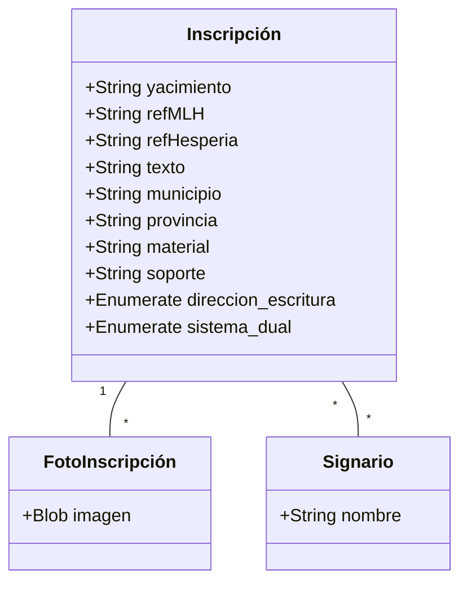

```mermaid
classDiagram
    class Inscripción {
        +String yacimiento
        +String refMLH
        +String refHesperia
        +String texto
        +String municipio
        +String provincia
        +String material
        +String soporte
        +Enumerate direccion_escritura
        +Enumerate sistema_dual
    }
    class FotoInscripción {
        +Blob imagen
    }
    class Signario {
        +String nombre
    }
    Inscripción "1" -- "*" FotoInscripción
    Inscripción "*" -- "*" Signario
```